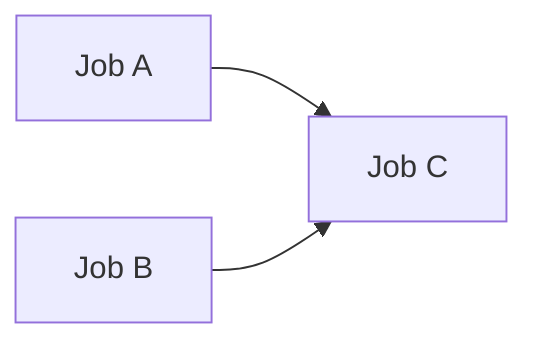
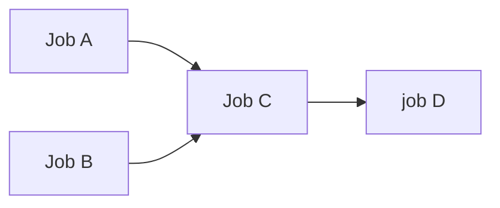

# github-needs-bug-reproduction

GitHub Actions の needs に関するトリッキーな挙動とそのワークアラウンドについて説明するレポジトリ。

## needs のトリッキーな挙動について

## case1

[workflow file](.github/workflows/case1_with_one_dependency.yml)

### Expected behavior
Whether jobA is executed or is skipped, jobC is executed.

### Actual behavior
- (OK) When jobA is executed, jobC is executed.
- (NG) When jobA is skipped, jobC is NOT executed.

## Workaround for case1
[workflow file](.github/workflows/case1_workaround.yml)

Added `if: ${{ !failure() && !cancelled() }}` in jobC level.

### Actual behavior
- (OK) When jobA is executed, jobC is executed.
- (OK) When jobA is skipped, jobC is executed.

## case2

[workflow file](.github/workflows/case2_with_some_dependencies.yml)

### Expected behavior
Whether jobA is executed or is skipped, jobC, joD is executed since I added `if: ${{ !failure() && !cancelled() }}` in jobC level.

### Actual behavior
- (OK) When jobA is executed, jobC and jobD are executed.
- (NG) When jobA is skipped, jobC is executed but jobD is NOT.

## Workaround for case2
[workflow file](.github/workflows/case2_workaround1.yml)

I needed to add `if: ${{ !failure() && !cancelled() }}` in every job level in the dependency chain.

### Actual behavior
- (OK) When jobA is executed, jobC and jobD are executed.
- (OK) When jobA is skipped, jobC and jobD are executed.

## Another workaround for case2
[workflow file](.github/workflows/case2_workaround2.yml)

Adding`if: ${{ !failure() && !cancelled() }}` in every job level is such a hassle and its maintainability is not good.
It might be better to use this workaround2 instead.
I wrote `if: \${{ !inputs.is-skip-jobA }}` at the step level instead of the job level.

### Actual behavior
- (OK) When jobA is executed, jobC and jobD are executed.
- (OK) When jobA is skipped, jobC and jobD are executed.
