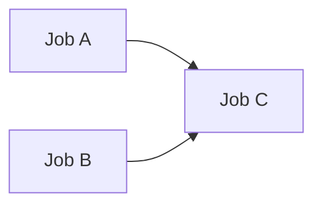

# github-needs-bug-reproduction

GitHub Actions の needs に関するトリッキーな挙動とそのワークアラウンドについて説明するレポジトリ。

## needs のトリッキーな挙動について

## case1

[workflow file](.github/workflows/case1_with_one_dependency.yml)

### Expected behavior
jobA を実行してもスキップしても jobC が実行される。

### Actual behavior
- (OK) jobA を実行したら jobC が実行される。
- (NG) jobA をスキップしたら jobC は実行されない。

## workaround for case1
[workflow file](.github/workflows/case1_workaround.yml)

Added `if: ${{ !failure() && !cancelled() }}` in jobC level.

### Actual behavior
- (OK) jobA を実行したら jobC が実行される。
- (OK) jobA をスキップしても jobC が実行される。

## case2

## workaround for case2
