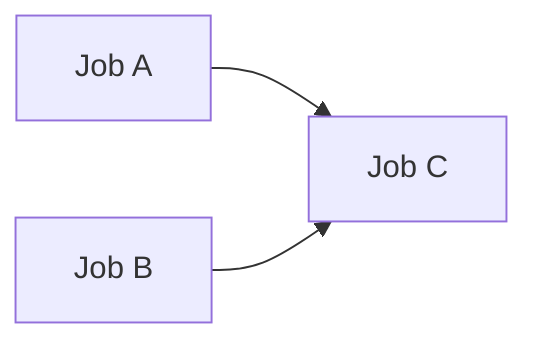
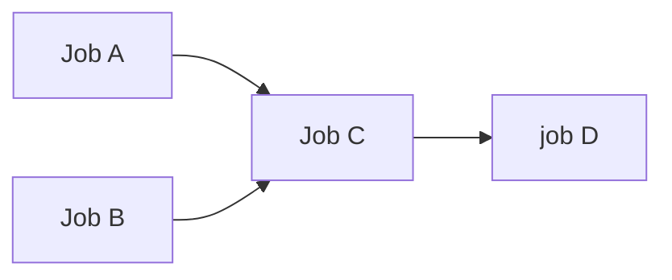

# github-needs-bug-reproduction
Inspired by https://github.com/suzuki-shunsuke/bug-reproduction-github-actions-success

I will explain a bit tricky example of `needs` behavior in GitHub Actions and the workaround.

## case1 - What the tricky behavior is

[workflow file](.github/workflows/case1_with_one_dependency.yml)

### Expected behavior
Whether jobA is executed or is skipped, jobC is executed.

### Actual behavior
- (OK) When jobA is executed, jobC is executed.
- (NG) When jobA is skipped, jobC is NOT executed.

The jobC depended on jobA and jobB and jobA succeeded and jobB was skipped, then jobC was skipped.

## Workaround for case1
[workflow file](.github/workflows/case1_workaround.yml)

Added `if: ${{ !failure() && !cancelled() }}` in jobC level.

### Actual behavior
- (OK) When jobA is executed, jobC is executed.
- (OK) When jobA is skipped, jobC is executed.

## case2: some jobs in the dependency chain

[workflow file](.github/workflows/case2_with_some_dependencies.yml)

### Expected behavior
Whether jobA is executed or is skipped, jobC, joD is executed since I added `if: ${{ !failure() && !cancelled() }}` in jobC level.

### Actual behavior
- (OK) When jobA is executed, jobC and jobD are executed.
- (NG) When jobA is skipped, jobC is executed but jobD is NOT.

This reason is here.

https://docs.github.com/en/actions/writing-workflows/workflow-syntax-for-github-actions#jobsjob_idneeds
>  If a job fails or is skipped, all jobs that need it are skipped unless the jobs use a conditional expression that causes the job to continue. If a run contains a series of jobs that need each other, a failure or skip applies to all jobs in the dependency chain from the point of failure or skip onwards. ref

## Workaround for case2
[workflow file](.github/workflows/case2_workaround1.yml)

I need to add `if: ${{ !failure() && !cancelled() }}` in every job level in the dependency chain.

### Actual behavior
- (OK) When jobA is executed, jobC and jobD are executed.
- (OK) When jobA is skipped, jobC and jobD are executed.

## Another workaround for case2
[workflow file](.github/workflows/case2_workaround2.yml)

Adding`if: ${{ !failure() && !cancelled() }}` in every job level is such a hassle and its maintainability is not good.

It might be better to use this workaround2 instead.
I wrote `if: \${{ !inputs.is-skip-jobA }}` at the step level instead of the job level.

### Actual behavior
- (OK) When jobA is executed, jobC and jobD are executed.
- (OK) When jobA is skipped, jobC and jobD are executed.

