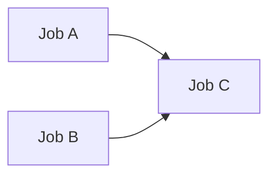

# github-needs-bug-reproduction

GitHub Actions の needs に関するトリッキーな挙動とそのワークアラウンドについて説明するレポジトリ。

## needs のトリッキーな挙動について

## case1

[workflow file](.github/workflows/case1_with_one_dependency.yml)

### Expected behavior
Whether jobA is executed or is skipped, jobC is executed.

### Actual behavior
- (OK) When jobA is executed, jobC is also executed.
- (NG) When jobA is skipped, jobC is NOT executed.

## workaround for case1
[workflow file](.github/workflows/case1_workaround.yml)

Added `if: ${{ !failure() && !cancelled() }}` in jobC level.

### Actual behavior
- (OK) When jobA is executed, jobC is also executed.
- (OK) When jobA is skipped, jobC is also executed.
